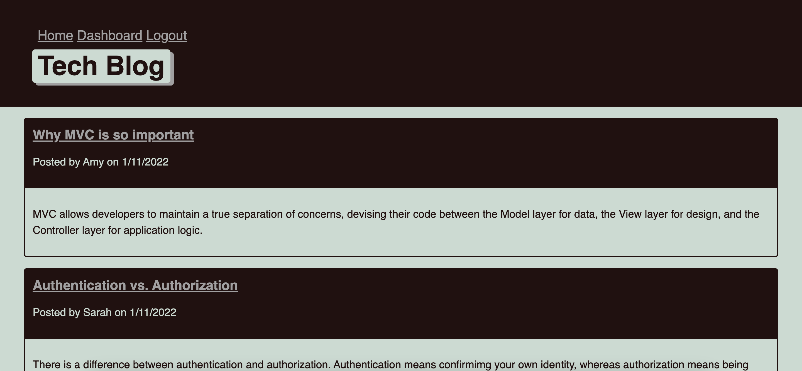

# Tech-blog

## Description
This is an app that is CMS-style blog site similar to a Wordpress site, where developers can publish their blog posts and comment on other developers’ posts as well. This app follows the MVC paradigm in its architectural structure, using Handlebars.js as the templating language, Sequelize as the ORM, and the express-session npm package for authentication. 

## Installation
Node.js, npm and Mysql must be installed to use this application.

## Usage

* To start using the application, open your browser and go to
  
  `http://localhost:3000/`

* Demo of application

  

* Websites
  * [Github](https://github.com/wl0194)
  * [Live Heroku App](https://evening-river-10388.herokuapp.com/)

## Features

* JavaScript
* Node.js
* Express

## License

Copyright (c) Amy Hwang. All rights reserved.

